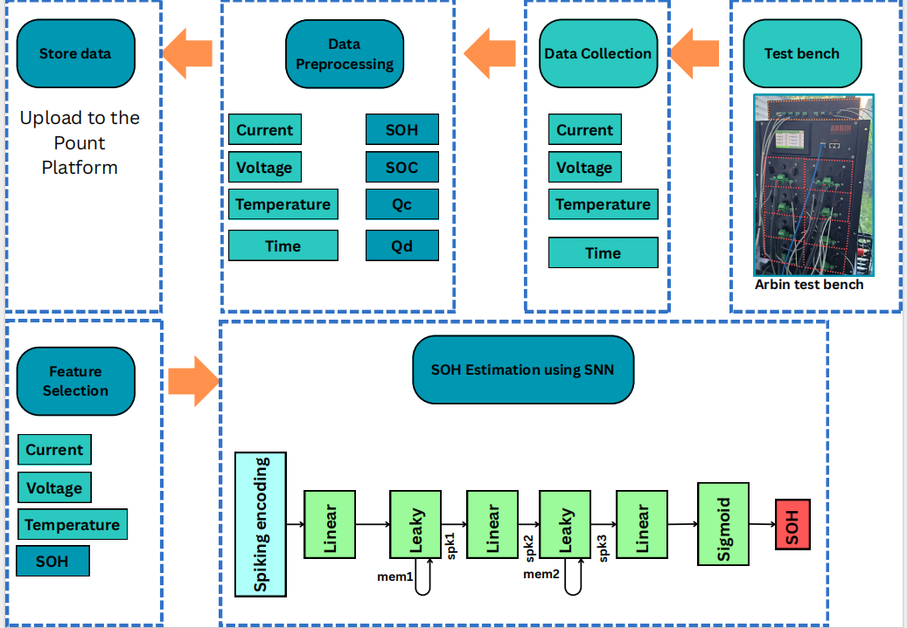

# Spiking Neural Networks for Accurate and Efficient SOH Estimation of Lithium-Ion Batteries

This repository contains the dataset and code associated with our research on **Spiking Neural Networks (SNNs)** for estimating the **State of Health (SOH)** of lithium-ion batteries across varying temperatures. Developed at **Université de Strasbourg, INSA de Strasbourg, ICube Laboratory (UMR 7357, CNRS)**.

---

## 📖 Overview

Lithium-ion battery health monitoring is essential for ensuring safety, reliability, and optimal performance. Conventional SOH estimation methods often require repeated charge/discharge cycles under strictly controlled laboratory conditions, limiting practical applicability.  

This project provides:

1. **A comprehensive LFP battery dataset**:  
   - 19 lithium iron phosphate (LFP) cells  
   - Cycle lifetimes: 500–2600 cycles  
   - Realistic conditions: **non-constant discharge currents**  
   - Tested at **25°C, 35°C, and 45°C**  

2. **A neuromorphic Spiking Neural Network (SNN) model**:  
   - Mimics biological neurons using **sparse, time-coded spikes**  
   - High temporal precision and **low energy consumption**  
   - Achieves **MAE of 4.5%** for SOH estimation  
   - **Inference time:** 3.55𝜇s, **Energy consumption:** 0.36 mJ  

---

## 📚 Reference

Slimane Arbaoui, Tedjani Mesbahi, Théo Heitzmann, Marwa Zitouni, Amel Hidouri, Lakhdar Mamouri, Ali Ayadi, Ahmed Samet, Romuald Boné. Spiking Neural Networks for Accurate and Efficient State-of-Health Estimation of Lithium-Ion Batteries Across Varying Temperatures. accepted to be published in IEEE Open Journal of Vehicular Technology on 08-Jan-2026.
